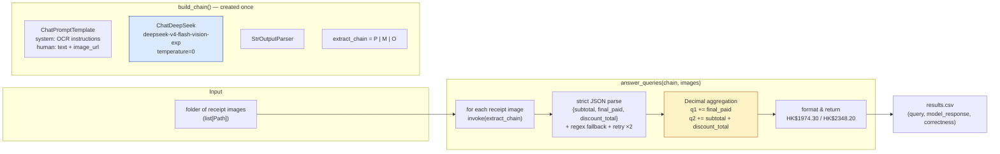

# FTEC5660 Homework 1: Receipt Chain

Build a LangChain pipeline that reads every supermarket receipt in a folder
with the vision-capable DeepSeek Flash model and answers these two questions:

1. How much money did I spend in total for these bills?
2. How much would I have had to pay without the discount?

For this homework, **amount spent** means the final payment after the receipt's
rounding line. **Without the discount** means the sum of the original positive
item prices: add back every promotion, coupon, member, app, packaging-damage,
and percentage discount, but do not add back rounding.

## Student task

Only edit the two functions in `hw1.py` that contain `### YOUR CODE HERE`:

- `build_chain()` creates your LangChain chain.
- `answer_queries()` runs the chain on the receipt images and returns one final
  response for each question.

You may use prompt chaining, routing, parallel calls, reflection, or a
combination. Your final responses should each contain one HKD amount. Do not
hard-code filenames or public answers; grading uses unseen receipt folders.

## Setup and public test

```bash
python3 -m venv .venv
source .venv/bin/activate
pip install -r requirements.txt
```

Put your DeepSeek key after `DEEPSEEK_API_KEY=` in `.env`, then run:

```bash
python3 hw1.py --image-folder public_test
```

The program creates `results.csv` in the current directory. Its columns are
`query`, `model_response`, and `correctness`. The public answers are in
`public_test/ground_truth.json`. The starter intentionally returns the dummy
response `please design your chain to answer these two queries.` so it runs
before you add any API code.

The required model is `deepseek-v4-flash-vision-exp`, the vision-capable
DeepSeek Flash model. JPEG, PNG, GIF, and WebP inputs are accepted by the
homework runner.


## Homework 1 solution

### Chain design



### Description

The solution is a two-stage LangChain pipeline built around the required
vision-capable backbone, `deepseek-v4-flash-vision-exp`.

In **stage 1**, `build_chain()` constructs one multimodal extraction chain
(`ChatPromptTemplate | ChatDeepSeek | StrOutputParser`): for every receipt the
prompt embeds the image as a base64 data URL (via the provided
`image_data_url()` helper) and instructs the model to return a strict JSON
object with exactly three fields — `subtotal` (the SUBTOTAL/小計 line before
ROUNDING), `final_paid` (the actual amount paid on the OCTOPUS/八達通/CASH/EPS
or "Amount Deducted" line, i.e. subtotal after the ROUNDING adjustment), and
`discount_total` (the sum of the absolute values of every discount, promotion,
coupon or price-adjustment line such as `5% OFF`, `Buy X Save`, `MB APP
UPGRADE`, `App Upgrade` and 包装变形 — while deliberately excluding ROUNDING
and non-discount charges like the plastic-bag fee). A robust parser first
tries `json.loads` (tolerating markdown code fences) and falls back to a
regex over the raw text; a malformed or implausible (negative) extraction
triggers at most two re-reads of the receipt.

In **stage 2**, the per-receipt numbers are accumulated with exact `Decimal`
arithmetic: query 1 sums every `final_paid` and query 2 sums every
`subtotal + discount_total`. Each answer is formatted as a single HKD amount
(`HK$1974.30`, `HK$2348.20`) so the automated checker's single-amount regex
accepts it, and the two values are returned under the exact query strings.
The chain runs on the public folder in one call to `answer_queries()`; on the
7 public receipts the extracted sums match `ground_truth.json` exactly.

